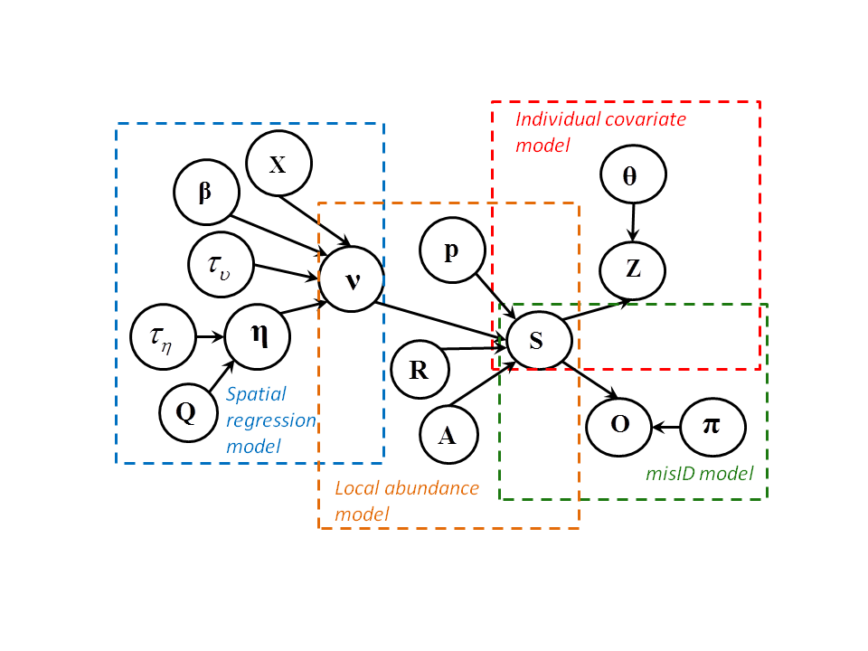

```{r setup, include=FALSE}
knitr::opts_chunk$set(echo = FALSE)
```

## Outline 

- Background
- Code: availability and dependencies
- Notation
- Example dataset
- Bayesian p-values
- 

## Background

- How do you go about assessing goodness-of-fit in a big hierarchical model?


## Code and dependencies

-Presentation and R Markdown code available at \url{www.github.com/pconn/CAPAM_talk}

-Some functions from HierarchicalGOF R package, install available at
\url{www.github.com/pconn/HierarchicalGOF}

NB: This package accompanied @ConnEtAl2018; never intended for production level use!  

-I will also make some use of the DHARMa package (@Hartig2021)

## Notation

-$[\boldsymbol{\theta}]$  : Marginal distribution of $\boldsymbol{\theta}$
-$[\textbf{Y} | \boldsymbol{\theta}]$: Conditional distribution of $\textbf{Y}$ given $\boldsymbol{\theta}$
-$[\boldsymbol{\theta} | \textbf{Y}]


## Slide with R Output

```{r cars, echo = TRUE}
summary(cars)
```

## Slide with Plot

```{r pressure}
plot(pressure)
```

