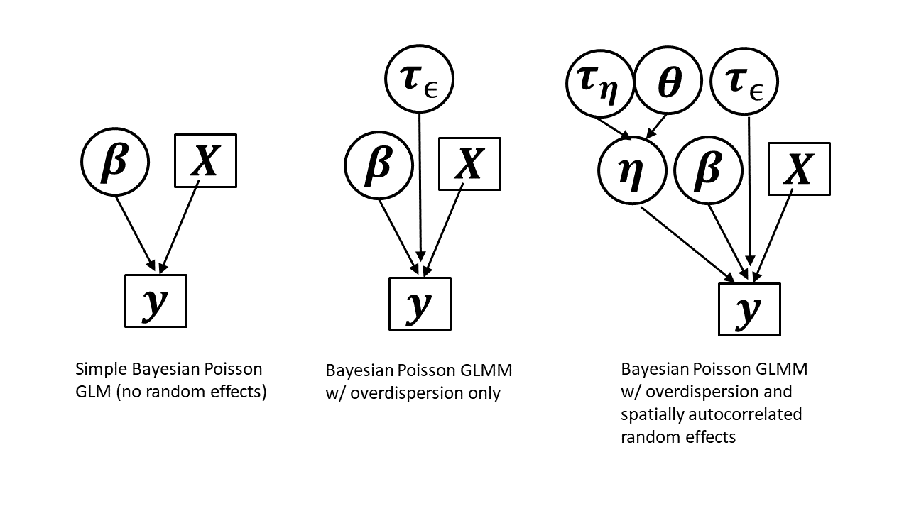
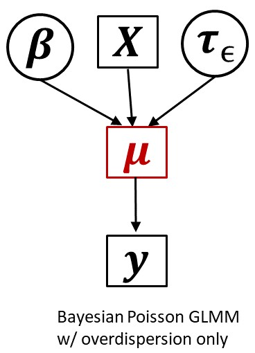

```{r setup, include=FALSE}
knitr::opts_chunk$set(echo = FALSE)
knitr::opts_chunk$set(warning = FALSE, message = FALSE) 
```


## Outline 

- Background
- Code: availability and dependencies
- Notation
- Example dataset & estimation models
- Posterior predictive checks
- Discrepancy functions
- Bayesian p-values 
- Sampled posterior p-values
- Pivotal discrepancy measures
- Cross validation
- Summary: Bayesian model checking
- GOF for integrated population models [@BesbeasMorgan2014]

## Background

- What this talk is *not*: introduction to Bayesian inference, model convergence diagnostics, model selection

- How do you go about assessing goodness-of-fit in a big hierarchical model?


## Code and dependencies

- Presentation and R Markdown code available at \url{www.github.com/pconn/BMC_CAPAM_talk}

- Some functions from HierarchicalGOF R package, install available at
\url{www.github.com/pconn/HierarchicalGOF}

NB: This package accompanied @ConnEtAl2018; never intended for production level use!  

- Some of these diagnostics are in the DHARMa R package [@Hartig2021]

## Notation

- Bold: vector or matrix

- $[\boldsymbol{\theta}]$  : Marginal distribution of $\boldsymbol{\theta}$

- $[\textbf{y} | \boldsymbol{\theta}]$: Conditional distribution of $\textbf{y}$ given $\boldsymbol{\theta}$

- $f(y_i|\boldsymbol{\theta})$: Probability mass or density function evaluated at $y_i$

- $F(y_i|\boldsymbol{\theta}) = \int_{-\infty}^{y_i} f(z|\boldsymbol{\theta}) dz$: Cumulative mass or density function evaluated at $y_i$

- $[\textbf{y}^{rep}|\textbf{y}] = \int [\textbf{y}^{rep}|\boldsymbol{\theta}][\boldsymbol{\theta}|\textbf{y}] d\boldsymbol{\theta}$: Posterior predictive distribution

## Example dataset

Simulated spatial count dataset (think CPUE index standardization with spatially autocorrelated random effects) with 200 randomly sampled locations.


\begin{eqnarray*}
  y_i & \sim & \textrm{Poisson}(\exp(\textbf{x}_i^\prime \boldsymbol{\beta} + \eta_i + \epsilon_i)) \\
 \boldsymbol{\eta} & \sim & \textrm{Predictive-process-exponential}(\theta,\tau_\eta)  \\
  \epsilon_i & \sim & \textrm{Normal}(0,1/\tau_\epsilon)
\end{eqnarray*}

## Example dataset

```{r sim_data, cache = TRUE}
set.seed(12345)
n_Y=200  #number of sample locations
Knots=expand.grid(c(0:8),c(0:8))/2  #knots for predictive process spatial model
n_k=nrow(Knots)
theta_true=2 #controls exponenial correlation decay
tau_eta_true=1  #precision of spatial autocorrelation process
tau_iid_true=5  #iid precision for extra-Poisson error
incr=(max(Knots)-min(Knots))/99
Beta_true=c(2,0.75)  #intercept, slope for relationship of log abundance to simulated covariate
Coords=matrix(runif(n_Y*2,0.5,3.5),n_Y,2)  
Coords_plot=expand.grid(x=c(0:99)*incr,y=c(c(0:99)*incr))  #everything with _plot after   
#distances between data points and knots, etc.
Dyy=fields::rdist(Coords,Coords)
Dyk=fields::rdist(Coords,Knots)
Dkk=fields::rdist(Knots,Knots)
Dpk=fields::rdist(Coords_plot,Knots)

#covariance associated with spatial random effects 
Cov_kk=fields::Exp.cov(Knots,theta=theta_true,distMat=Dkk)/tau_eta_true
Cov_yk=fields::Exp.cov(Coords,Knots,theta=theta_true,distMat=Dyk)/tau_eta_true
Cov_pk=fields::Exp.cov(Coords_plot,Knots,theta=theta_true,distMat=Dpk)/tau_eta_true

#spatial random effects "design matrix"
Cov_kk_inv = solve(Cov_kk)
X_RE_true = Cov_yk %*% Cov_kk_inv
X_RE_plot = Cov_pk %*% Cov_kk_inv

#generate spatially autocorrelated covariate
library(spatstat) 
Matern_points = rMatClust(kappa=12,r=.25,mu=100)  #generate some points from a matern process to construct a hypothetical covariate
Matern_xy=cbind(Matern_points$x,Matern_points$y)*max(Knots[,1])
Matern_kde=MASS::kde2d(Matern_xy[,1],Matern_xy[,2],100,h=0.5,lims=c(0,max(Knots[,1]),0,max(Knots[,2])))
Wts=1/(fields::rdist(Coords,expand.grid(x=Matern_kde$x,y=Matern_kde$y)))^2
Wts=Wts*1/rowSums(Wts)
Pred_cov =  Wts %*% matrix(Matern_kde$z,ncol=1) #hypothetical habitat covariate
denom=mean(Pred_cov)
Pred_cov=Pred_cov/denom  #standardize to have a mean on 1.0
Pred_cov_plot=as.vector(Matern_kde$z)/denom #have same standardization as for covariates used for fitting 

#design matrix for fixed effects
X=matrix(1,nrow=n_Y,ncol=2)  
X[,2]=Pred_cov  # linear term only
X_plot=matrix(1,nrow=10000,ncol=2) 
X_plot[,2]=Pred_cov_plot


#generate spatial random effects
Eta_k_true=matrix(mvtnorm::rmvnorm(1,rep(0,n_k),Cov_kk),ncol=1)
Eta_true=X_RE_true%*%Eta_k_true
Eta_plot = X_RE_plot%*%Eta_k_true
  
#simulate observed counts
Sim_lambda=exp(rnorm(n_Y,X%*%Beta_true+Eta_true,sqrt(1/tau_iid_true)))
Y=rpois(n_Y,Sim_lambda)
Mu_plot = exp(X_plot %*% Beta_true+X_RE_plot%*%Eta_k_true)


#make some plots!
library(ggplot2)
library(RColorBrewer)
incr=(max(Knots)-min(Knots))/99  #for a 100x100 surface tessalation

plot.prediction.map<-function(N,Coords,highlight=NULL,myPalette=NULL,leg.title="Abundance"){
  if(is.null(myPalette))myPalette <- colorRampPalette(brewer.pal(9, "YlOrBr"))
  if(is.null(highlight)==FALSE){
    midpoints=Coords[highlight,]
    colnames(midpoints)=c("Easting","Northing")
  }
  Abundance=N
  Cur.df=cbind(Coords,Abundance)
  new.colnames=colnames(Cur.df)
  new.colnames[1:2]=c("Easting","Northing")
  colnames(Cur.df)=new.colnames
  Grid.theme=theme(axis.ticks = element_blank(), axis.text = element_blank())
  p1=ggplot(Cur.df)+aes(Easting,Northing,fill=Abundance)+geom_raster()+Grid.theme+scale_fill_gradientn(colours=myPalette(100),name=leg.title)
  if(is.null(highlight)==FALSE){
    p1=p1+geom_rect(data=midpoints,size=0.5,fill=NA,colour="yellow",aes(xmin=Easting-25067/2,xmax=Easting+25067/2,ymin=Northing-25067/2,ymax=Northing+25067/2))
  }
  p1
}

cov_map = plot.prediction.map(N=as.vector(Matern_kde[[3]]),Coords=data.frame(Coords_plot),myPalette=colorRampPalette(brewer.pal(9, "Greens")),highlight=NULL,leg.title="Value")

re_map = plot.prediction.map(N=as.vector(Eta_plot),Coords=data.frame(Coords_plot),myPalette=colorRampPalette(brewer.pal(9, "Blues")),highlight=NULL,leg.title="Value")
Mu_map = plot.prediction.map(N=as.vector(Mu_plot),Coords=data.frame(Coords_plot),highlight=NULL,leg.title="Value")
Pts_df = data.frame("Easting"=as.vector(Coords[,1]),"Northing"=as.vector(Coords[,2]),"Abundance"=rep(0,n_Y))
Mu_map=Mu_map + geom_point(data=Pts_df,aes(x=Easting,y=Northing),size=0.5)
Knots_df = data.frame("Easting"=as.vector(Knots[,1]),"Northing"=as.vector(Knots[,2]),"Abundance"=rep(0,n_k))
Mu_map=Mu_map + geom_point(data=Knots_df,aes(x=Easting,y=Northing),size=1,shape=1)

Count_df = Pts_df
colnames(Count_df)[3]="Count"
Count_df[,3]=Y
myPalette <- colorRampPalette(brewer.pal(9, "YlOrBr"))
Grid.theme=theme(axis.ticks = element_blank(), axis.text = element_blank())
Count_map = ggplot(Count_df)+geom_point(aes(x=Easting,y=Northing,colour=Count),size=1.5)+Grid.theme+scale_color_gradientn(colours=myPalette(100),name="Value")
title_theme=theme(plot.title = element_text(hjust = 0,size=12))

library(gridExtra)
grid.arrange(arrangeGrob(cov_map+ggtitle("A. Covariate")+title_theme,re_map+ggtitle("B. Spatial random effects")+title_theme,Mu_map+ggtitle("C. Expected abundance")+title_theme,Count_map+ggtitle("D. Simulated count")+title_theme,nrow=2))


```


## Example estimation models
  



## Posterior predictive checks

Posterior predictive distribution: 

$[\textbf{y}^{rep}|\textbf{y}] = \int [\textbf{y}^{rep}|\boldsymbol{\theta}][\boldsymbol{\theta}|\textbf{y}] d\boldsymbol{\theta}$

Practically: 

1. Sample from the posterior $\boldsymbol{\theta}^{rep} \sim [\boldsymbol{\theta} | \textbf{y}]$

2. Generate replicated posterior predictive data ${\bf y}^{rep}|\boldsymbol{\theta}^{rep}$.

3. Compare real data to simulated data in some fashion.  Do they look similar?


## Graphical checks

Many possible checks, perhaps used more informally since assessment of fit from graphs is somewhat subjective.  See, e.g. \texttt{bayesplot} library for \texttt{Stan} users.

Example: Generate "null" distribution of Moran-I statistic values for posterior predictions and compare to those for observed data (shown: Bayesian GLM)

```{r fit_models, cache = TRUE, message=FALSE, results=FALSE}
  # fit three Bayesian models to simulated data, produce summary
  # plots and keep track of Bayesian p-values

##### Run spatial poisson regression models using JAGS

  #NB: note this is originally from the script "run_Poisson_JAGS_sims.R" in the HierarchicalGOF package; I'm not conducting multiple simulations here so there is some unneeded baggage
library(rjags)
library(R2jags)
devtools::install_github("pconn/HierarchicalGOF/HierarchicalGOF")
library(HierarchicalGOF)
n_sims = 1 
n_Y=200  #number of sample locations
Knots=expand.grid(c(0:8),c(0:8))/2  #knots for predictive process spatial model
n_k=nrow(Knots)
theta_true=2 #controls exponenial correlation decay
tau_eta_true=1  #precision of spatial autocorrelation process
tau_iid_true=5  #iid precision for extra-Poisson error
incr=(max(Knots)-min(Knots))/99
Beta_true=c(2,0.75)  #intercept, slope for relationship of log abundance to simulated covariate
#MCMC options
n_iter = 2000
n_burnin = 500  
n_thin = 1
n_chains=3  
n_mcmc=n_chains*(n_iter-n_burnin)/n_thin #total number of recorded MCMC iterations
MoranI=rep(0,n_mcmc)
MoranI_sim = MoranI


##### Initialize data structures for storing simulation results ######
Colnames=c("pois0_postp_chisq","pois0_postp_ft","pois0_postp_dev","pois0_postp_tail","pois0_postp_0","pois0_moran","pois0_pivot","pois0_sampled",
           "poisIID_postp_chisq","poisIID_postp_ft","poisIID_postp_dev1","poisIID_postp_dev2","poisIID_postp_tail","poisIID_postp_0","poisIID_moran","poisIID_pivot1","poisIID_pivot2","poisIID_sampled1","poisIID_sampled2","poisIID_cv","poisIID_cv_outliers",
           "poisSpat_postp_chisq","poisSpat_postp_ft","poisSpat_postp_ft_mixed","poisSpat_postp_dev1","poisSpat_postp_dev2","poisSpat_postp_tail","poisSpat_postp_0","poisSpat_moran","poisSpat_pivot1","poisSpat_pivot2","poisSpat_sampled1","poisSpat_sampled2")
Results = data.frame(matrix(0,n_sims,length(Colnames)))
colnames(Results) = Colnames

#### Initialize some structures needed for spatially autocorrelated Poisson estimation model
max_range=4
n_incr=10
incr=max_range/n_incr
Cor_k=Q_k=array(0,dim=c(n_k,n_k,n_incr))
Q_k_partial = array(0,dim=c(n_k,n_k-1,n_k-1,n_incr)) #for partial posterior prediction
Cor_partial = array(0,dim=c(n_k,n_k-1,n_incr)) 
X_RE=array(0,dim=c(n_Y,n_k,n_incr))
Tmp=c(1:n_k)
P=rep(incr,n_incr)*c(1:n_incr)

var.fcn.pois = mean.fcn.pois = function(x){
  return(x)
}
mean.fcn.normal <- function(Theta){ #takes Mu[1:n],tau
  n_par=length(Theta)
  return(Theta[1:n_par])
}
var.fcn.normal <- function(Theta){ #takes Mu[1:n],tau
  n_par=length(Theta)
  return(1/Theta[n_par])
}

mean.fcn.pois<-var.fcn.pois<-function(Theta){
  return(Theta)
}

my.pnorm<-function(Y,Theta){
  n_par=length(Theta)
  return(pnorm(Y,Theta[1:n_par],sqrt(1/Theta[n_par])))
}
my.dnorm<-function(Y,Theta){
  n_par=length(Theta)
  return(dnorm(Y,Theta[1:n_par],sqrt(1/Theta[n_par])))
}

my.ppois<-function(Y,Theta)ppois(Y,Theta)
my.dpois<-function(Y,Theta)dpois(Y,Theta)


#####  BEGIN SIMULATIONS #####
cur_time = proc.time()
for(isim in 1:n_sims){
  Y_mat=matrix(Y,n_Y,n_mcmc)  #needed for pivot function

  #conduct MCMC analysis of counts using a Poisson regression model without random effects
  n_B=ncol(X)
  jags_data = list("n_Y","n_B","Y","X")
  jags_params = c("Beta","Y_sim")
  jags_save =c("Beta","Y_sim","Lambda","dev_pred","deviance","dev_y")
  jags.inits = function(){
    list("Beta"=rnorm(n_B),"Y_sim"=rgamma(n_Y,10,1))
  }
  jags_fit = R2jags::jags(data=jags_data,
                  inits=jags.inits,
                  jags_params,
                  n.iter=n_iter,
                  model.file=pois.no.spat,
                  DIC=FALSE,
                  parameters.to.save=jags_save,
                  n.chains=n_chains,
                  n.burnin=n_burnin,
                  n.thin=n_thin,
                  working.directory=getwd())
  
  # calculate goodness-of-fit metrics on basic Poisson regression model
  MoranI=rep(0,n_mcmc)
  #select appropriate columns form jags MCMC output matrix
  Cols_Y_sim=grep("Y_sim",colnames(jags_fit$BUGSoutput$sims.matrix))
  Cols_Lambda=grep("Lambda",colnames(jags_fit$BUGSoutput$sims.matrix))
  Cols_Beta=grep("Beta",colnames(jags_fit$BUGSoutput$sims.matrix))
  Dists_inv=1/Dyy   #(Dyy<.38)*1
  diag(Dists_inv)=0
  p_omni=p_tail=p_0=p_ft=0
  y_quant95 = quantile(Y,0.95)
  y_0 = sum(Y==0)
  for(i in 1:n_mcmc){
    MoranI[i]=Moran.I(Y-jags_fit$BUGSoutput$sims.matrix[i,Cols_Lambda],Dists_inv)$observed
    MoranI_sim[i]=Moran.I(jags_fit$BUGSoutput$sims.matrix[i,Cols_Y_sim]-jags_fit$BUGSoutput$sims.matrix[i,Cols_Lambda],Dists_inv)$observed

    chisq=sum((jags_fit$BUGSoutput$sims.matrix[i,Cols_Y_sim]-jags_fit$BUGSoutput$sims.matrix[i,Cols_Lambda])^2/jags_fit$BUGSoutput$sims.matrix[i,Cols_Lambda])
    chisq_y=sum((Y-jags_fit$BUGSoutput$sims.matrix[i,Cols_Lambda])^2/jags_fit$BUGSoutput$sims.matrix[i,Cols_Lambda])  
    ft=sum((sqrt(jags_fit$BUGSoutput$sims.matrix[i,Cols_Y_sim])-sqrt(jags_fit$BUGSoutput$sims.matrix[i,Cols_Lambda]))^2)
    ft_y=sum((sqrt(Y)-sqrt(jags_fit$BUGSoutput$sims.matrix[i,Cols_Lambda]))^2)
    p_omni = p_omni+(chisq_y<chisq)
    p_ft = p_ft + (ft_y<ft)
    p_tail = p_tail + (y_quant95<quantile(jags_fit$BUGSoutput$sims.matrix[i,Cols_Y_sim],0.95))
    p_0 = p_0 + (y_0<sum(jags_fit$BUGSoutput$sims.matrix[i,Cols_Y_sim]==0)) + 0.5
  }
  Results[isim,"pois0_postp_chisq"]=p_omni/n_mcmc
  Results[isim,"pois0_postp_tail"] = p_tail/n_mcmc
  Results[isim,"pois0_postp_0"] = p_0/n_mcmc
  Results[isim,"pois0_postp_ft"] = p_ft/n_mcmc
  Results[isim,"pois0_postp_dev"] = sum(jags_fit$BUGSoutput$sims.matrix[,"deviance"]<jags_fit$BUGSoutput$sims.matrix[,"dev_pred"])/n_mcmc
  Results[isim,"pois0_moran"]=sum(MoranI<MoranI_sim)/n_mcmc
  pivot_out = chisq.cdf.test(Y=Y_mat,Theta=t(jags_fit$BUGSoutput$sims.matrix[,Cols_Lambda]),mean.fcn=mean.fcn.pois,var.fcn=var.fcn.pois,cdf.fcn=ppois,pmf.fcn=dpois,K=5,L=5,DISCRETE=TRUE)
  Results[isim,"pois0_sampled"]=sample(pivot_out$pval_omni,1)
  Results[isim,"pois0_pivot"]=median(pivot_out$pval_omni)
  
    Plot_df = data.frame(MoranI = c(MoranI,MoranI_sim), Type = rep(c("Observed","Prediction"),each=n_mcmc))
  Hist1 = ggplot(Plot_df)+geom_density(aes(x=MoranI,linetype=Type),colour='black')+ylab('Density') + theme(text = element_text(size = 10))  + xlab("Moran's I")
  Hist1
    
  #Run poisson model with IID Gaussian random effects
  jags_data = list("n_Y","n_B","Y","X")
  jags_params = c("Beta","tau_iid","Nu0","Nu_pred","Y_sim1","Y_sim2")
  jags_save =c("Beta","Y_sim1","Y_sim2","Lambda","Lam_pred","Nu0","Mu","deviance","dev_pred1","dev_y1","dev_pred2","dev_y2","tau_iid")
  jags.inits = function(){
    #list("Beta"=rnorm(n_B),"psi"=rgamma(1,1,1),"Nu"=rgamma(n_Y,1,1),"Nu_pred"=rgamma(n_Y,1,1))
    list("Beta"=rnorm(n_B),"tau_iid"=rgamma(1,1,.1),"Nu0"=log(Y+0.1)+rnorm(n_Y),"Nu_pred"=log(Y+0.1)+rnorm(n_Y),"Y_sim1"=exp(log(Y+0.1)+rnorm(n_Y)),"Y_sim2"=exp(log(Y+0.1)+rnorm(n_Y)))
  }
  jags_fit = jags(data=jags_data,
                  inits=jags.inits,
                  jags_params,
                  n.iter=n_iter,
                  model.file=pois.overd.no.spat,
                  DIC=FALSE,
                  parameters.to.save=jags_save,
                  n.chains=n_chains,
                  n.burnin=n_burnin,
                  n.thin=n_thin,
                  working.directory=getwd())
  
  ##### calculate Moran's I for residuals, Chi-square omnibus test, Targeted skewness check
  MoranI=rep(0,n_mcmc)
  #select appropriate columns form jags MCMC output matrix
  Cols_Y_sim1=grep("Y_sim1",colnames(jags_fit$BUGSoutput$sims.matrix))
  Cols_Y_sim2=grep("Y_sim2",colnames(jags_fit$BUGSoutput$sims.matrix))
  Cols_Lambda=grep("Lambda",colnames(jags_fit$BUGSoutput$sims.matrix))
  Cols_Lam_Pred=grep("Lam_pred",colnames(jags_fit$BUGSoutput$sims.matrix))
  Cols_Mu=grep("Mu",colnames(jags_fit$BUGSoutput$sims.matrix))
  Cols_Nu=grep("Nu0",colnames(jags_fit$BUGSoutput$sims.matrix)) 
  Cols_Beta=grep("Beta",colnames(jags_fit$BUGSoutput$sims.matrix))
  Dists_inv=1/Dyy
  diag(Dists_inv)=0
  p_omni=p_tail=p_0=p_ft=0
  for(i in 1:n_mcmc){
    Mu_tmp = exp(jags_fit$BUGSoutput$sims.matrix[i,Cols_Mu])*exp(0.5/jags_fit$BUGSoutput$sims.matrix[i,"tau_iid"]) #includes lognormal bias correction
    MoranI[i]=Moran.I(Y-jags_fit$BUGSoutput$sims.matrix[i,Cols_Lam_Pred],Dists_inv)$observed
    chisq=sum((jags_fit$BUGSoutput$sims.matrix[i,Cols_Y_sim2]-Mu_tmp)^2/Mu_tmp)
    chisq_y=sum((Y-Mu_tmp)^2/Mu_tmp)  
    ft=sum((sqrt(jags_fit$BUGSoutput$sims.matrix[i,Cols_Y_sim2])-sqrt(Mu_tmp))^2)
    ft_y=sum((sqrt(Y)-sqrt(Mu_tmp))^2)
    p_ft = p_ft + (ft_y<ft)
    p_omni = p_omni+(chisq_y<chisq)
    p_tail = p_tail + (y_quant95<quantile(jags_fit$BUGSoutput$sims.matrix[i,Cols_Y_sim2],0.95))
    p_0 = p_0 + (y_0<sum(jags_fit$BUGSoutput$sims.matrix[i,Cols_Y_sim2]==0)) 
  }
  Results[isim,"poisIID_postp_chisq"]=p_omni/n_mcmc
  Results[isim,"poisIID_postp_tail"] = p_tail/n_mcmc
  Results[isim,"poisIID_postp_0"] = p_0/n_mcmc
  Results[isim,"poisIID_moran"]=sum(MoranI<0)/n_mcmc
  Results[isim,"poisIID_postp_dev1"] = sum(jags_fit$BUGSoutput$sims.matrix[,"dev_y1"]<jags_fit$BUGSoutput$sims.matrix[,"dev_pred1"])/n_mcmc
  Results[isim,"poisIID_postp_dev2"] = sum(jags_fit$BUGSoutput$sims.matrix[,"dev_y2"]<jags_fit$BUGSoutput$sims.matrix[,"dev_pred2"])/n_mcmc
  Results[isim,"poisIID_postp_ft"] = p_ft/n_mcmc
  #test poisson part of poisson-normal mixture
  pivot_out=chisq.cdf.test(Y=Y_mat,Theta=t(jags_fit$BUGSoutput$sims.matrix[,Cols_Lambda]),mean.fcn=mean.fcn.pois,var.fcn=var.fcn.pois,cdf.fcn=ppois,pmf.fcn=dpois,K=5,L=5,DISCRETE=TRUE)
  Results[isim,"poisIID_sampled1"]=sample(pivot_out$pval_omni,1)
  Results[isim,"poisIID_pivot1"]=median(pivot_out$pval_omni)
    #test normal part of poisson-normal mixture using pivotal discrepancy
  pivot_out=chisq.cdf.test(Y=t(jags_fit$BUGSoutput$sims.matrix[,Cols_Nu]),
                           Theta=t(cbind(jags_fit$BUGSoutput$sims.matrix[,Cols_Mu],
                                         jags_fit$BUGSoutput$sims.matrix[,"tau_iid"])),
                           mean.fcn=mean.fcn.normal,var.fcn=var.fcn.normal,
                           cdf.fcn=my.pnorm,pmf.fcn=my.dnorm,K=5,L=5,DISCRETE=FALSE)
  Results[isim,"poisIID_sampled2"]=sample(pivot_out$pval_omni,1)
  Results[isim,"poisIID_pivot2"]=median(pivot_out$pval_omni)
  #conduct k-fold cross validation (40 folds of n=5)
  n_cv_k = 5
  n_cv_reps = n_Y/n_cv_k
  n_cv_Y = n_Y - n_cv_k
  Samples = matrix(0,n_Y/n_cv_k,n_cv_k)
  Cur_y = c(1:n_Y)
  for(i in 1:n_cv_reps){  #generate test groupings for k-fold cross validation
    Samples[i,]=sample(Cur_y,n_cv_k)
    Cur_y = Cur_y[-which(Cur_y %in% Samples[i,])]
  }
  D_cv = rep(0,n_Y)
  for(i in 1:n_cv_reps){
    which_Y = c(1:n_Y)[-Samples[i,]]
    Y_cv = Y[which_Y]
    X_cv = X[which_Y,]
    X_pred = X[Samples[i,],]
    jags_data = list("n_Y"=n_cv_Y,"n_B"=n_B,"n_k"=n_cv_k,"Y"=Y_cv,"X"=X_cv,"X_pred"=X_pred)
    jags_params = c("Beta","tau_iid","Nu0","Nu_sim","Nu_pred","Y_sim","Y_pred")
    jags_save =c("Lam_pred")
    jags.inits = function(){
      list("Beta"=rnorm(n_B),"tau_iid"=rgamma(1,1,.1),"Nu0"=log(Y_cv+0.1)+rnorm(n_cv_Y),"Nu_sim"=log(Y_cv+0.1)+rnorm(n_cv_Y),"Nu_pred"=log(mean(Y_cv)+0.1)+rnorm(n_cv_k),"Y_sim"=exp(log(Y_cv+0.1)+rnorm(n_cv_Y)),"Y_pred"=exp(log(mean(Y_cv))+rnorm(n_cv_k)))
    }
    jags_fit = jags(data=jags_data,
                    inits=jags.inits,
                    jags_params,
                    n.iter=n_iter,
                    model.file=pois.overd.no.spat.cv,
                    DIC=FALSE,
                    parameters.to.save=jags_save,
                    n.chains=n_chains,
                    n.burnin=n_burnin,
                    n.thin=n_thin,
                    working.directory=getwd())
    for(k in 1:n_cv_k){
      D_cv[(i-1)*n_cv_k+k] = sum((jags_fit$BUGSoutput$sims.matrix[,k]<Y[Samples[i,k]])+0.5*(jags_fit$BUGSoutput$sims.matrix[,k]==Y[Samples[i,k]]))
    }
  }
  D_cv = D_cv/n_mcmc
  Chisq_bounds = c(0:10)/10
  Chisq_bounds[1]=-1
  Chisq_bounds[11]=1.1
  D_cat=tabulate(as.numeric(cut(D_cv,Chisq_bounds)),nbins=10)
  T_cv = sum((D_cat - n_Y/10)^2)*10/n_Y #chi-square value w/ 10 bins 
  Results[isim,"poisIID_cv"]=1-pchisq(T_cv,df=9)  
  Results[isim,"poisIID_cv_outliers"]=sum(D_cv<0.001)
  
  #run Poisson model w/ IID Gaussian REs AND spatially autocorrelated REs (blocky predictive process formulation)  
  Zero_k = rep(0,n_k)
  #discretize covariance matrices and related quantities so all matrix inverse
  #calculations can be done up front and provided as input to JAGS
  for(i in 1:n_incr){
    Cor_k[,1:n_k,i]=Exp.cov(Knots,theta=incr*i,distMat=Dkk)
    Q_k[,1:n_k,i]=solve(Cor_k[,1:n_k,i])
    X_RE[,1:n_k,i]=Exp.cov(Coords,Knots,theta=incr*i,distMat=Dyk)%*%Q_k[,1:n_k,i]
    for(k in 1:n_k){
      Q_k_partial[k,,,i]=solve(Cor_k[Tmp[-k],Tmp[-k],i])
      Cor_partial[k,,i] = Cor_k[k,Tmp[-k],i]
    }
  }
  jags_data = list("n_Y","n_B","Y","X","Zero_k","Q_k","X_RE","n_k","P")
  jags_params = c("Beta","Nu0","Nu_pred","tau_sp","tau_iid","theta","Eta_k","Y_sim1","Y_sim2")
  jags_save =c("Beta","tau_sp","tau_iid","theta","Y_sim1","Y_sim2","Mu","Nu0","Nu_pred","Eta_k","dev_pred1","dev_y1","dev_pred2","dev_y2")
  jags.inits = function(){
    list("Beta"=rnorm(n_B),"Nu0"=rnorm(n_Y,3.0,0.5),"Nu_pred"=rnorm(n_Y,3.0,0.5),"tau_iid"=runif(1,1,10),"tau_sp"=runif(1,1,10),"theta"=round(runif(1,0.5,max_range+0.5)),"Eta_k"=rnorm(n_k))
  }
  jags_fit = jags(data=jags_data,
                  inits=jags.inits,
                  jags_params,
                  n.iter=n_iter,
                  model.file=pois.spat.model,
                  DIC=FALSE,
                  parameters.to.save=jags_save,
                  n.chains=n_chains,
                  n.burnin=n_burnin,
                  n.thin=n_thin,
                  working.directory=getwd())
  
  ##### calculate GOF tests for spatially autocorrelated model
  MoranI=rep(0,n_mcmc)
  #select appropriate columns form jags MCMC output matrix
  Cols_Y_sim1=grep("Y_sim1",colnames(jags_fit$BUGSoutput$sims.matrix))
  Cols_Y_sim2=grep("Y_sim2",colnames(jags_fit$BUGSoutput$sims.matrix))
  Cols_Mu=grep("Mu",colnames(jags_fit$BUGSoutput$sims.matrix))
  Cols_Nu=grep("Nu0",colnames(jags_fit$BUGSoutput$sims.matrix)) 
  Cols_Nu_pred = grep("Nu_pred",colnames(jags_fit$BUGSoutput$sims.matrix)) 
  Cols_Beta=grep("Beta",colnames(jags_fit$BUGSoutput$sims.matrix))
  Cols_Eta_k = grep("Eta_k",colnames(jags_fit$BUGSoutput$sims.matrix))
  Lambda=exp(jags_fit$BUGSoutput$sims.matrix[,Cols_Nu])
  Lam_pred = exp(jags_fit$BUGSoutput$sims.matrix[,Cols_Nu_pred])
  Dists_inv=1/Dyy
  diag(Dists_inv)=0
  p_omni=p_tail=p_0=p_ft=0
  for(i in 1:n_mcmc){
    Mu_tmp = exp(jags_fit$BUGSoutput$sims.matrix[i,Cols_Mu])*exp(0.5/jags_fit$BUGSoutput$sims.matrix[i,"tau_iid"]) #includes lognormal bias correction
    MoranI[i]=Moran.I(Y-Lam_pred[i,],Dists_inv)$observed
    chisq=sum((jags_fit$BUGSoutput$sims.matrix[i,Cols_Y_sim2]-Mu_tmp)^2/Mu_tmp)
    chisq_y=sum((Y-Mu_tmp)^2/Mu_tmp)  
    ft=sum((sqrt(jags_fit$BUGSoutput$sims.matrix[i,Cols_Y_sim2])-sqrt(Mu_tmp))^2)
    ft_y=sum((sqrt(Y)-sqrt(Mu_tmp))^2)
    p_ft = p_ft + (ft_y<ft)
    p_omni = p_omni+(chisq_y<chisq)
    p_tail = p_tail + (y_quant95<quantile(jags_fit$BUGSoutput$sims.matrix[i,Cols_Y_sim2],0.95))
    p_0 = p_0 + (y_0<sum(jags_fit$BUGSoutput$sims.matrix[i,Cols_Y_sim2]==0)) 
  }
  Results[isim,"poisSpat_postp_chisq"]=p_omni/n_mcmc
  Results[isim,"poisSpat_postp_tail"] = p_tail/n_mcmc
  Results[isim,"poisSpat_postp_0"] = p_0/n_mcmc
  Results[isim,"poisSpat_moran"]=sum(MoranI<0)/n_mcmc
  Results[isim,"poisSpat_postp_dev1"] = sum(jags_fit$BUGSoutput$sims.matrix[,"dev_y1"]<jags_fit$BUGSoutput$sims.matrix[,"dev_pred1"])/n_mcmc
  Results[isim,"poisSpat_postp_dev2"] = sum(jags_fit$BUGSoutput$sims.matrix[,"dev_y2"]<jags_fit$BUGSoutput$sims.matrix[,"dev_pred2"])/n_mcmc
  Results[isim,"poisSpat_postp_ft"] = p_ft/n_mcmc
  #test poisson part of poisson-normal mixture
  pivot_out=chisq.cdf.test(Y=Y_mat,Theta=t(Lambda),mean.fcn=mean.fcn.pois,var.fcn=var.fcn.pois,cdf.fcn=ppois,pmf.fcn=dpois,K=5,L=5,DISCRETE=TRUE)
  Results[isim,"poisSpat_sampled1"]=sample(pivot_out$pval_omni,1)
  Results[isim,"poisSpat_pivot1"]=median(pivot_out$pval_omni)
  #test Gaussian part of mixture
  pivot_out=chisq.cdf.test(Y=t(jags_fit$BUGSoutput$sims.matrix[,Cols_Nu]),
                           Theta=t(cbind(jags_fit$BUGSoutput$sims.matrix[,Cols_Mu],
                                         jags_fit$BUGSoutput$sims.matrix[,"tau_iid"])),
                           mean.fcn=mean.fcn.normal,var.fcn=var.fcn.normal,
                           cdf.fcn=my.pnorm,pmf.fcn=my.dnorm,K=5,L=5,DISCRETE=FALSE)
  Results[isim,"poisSpat_sampled2"]=sample(pivot_out$pval_omni,1)
  Results[isim,"poisSpat_pivot2"]=median(pivot_out$pval_omni)
  ### post hoc mixed predictive p-value by resimulating spatial random effects
  p_omni_mixed = 0
  Eta_tmp=rep(0,n_k)
  for(i in 1:n_mcmc){
    theta=jags_fit$BUGSoutput$sims.matrix[i,"theta"]
    Beta=jags_fit$BUGSoutput$sims.matrix[i,Cols_Beta]
    for(ik in 1:n_k){
      Tmp_cor = matrix(Cor_partial[ik,,theta],nrow=1)
      Eta_tmp[ik]=rnorm(1,Tmp_cor%*%Q_k_partial[ik,,,theta]%*%jags_fit$BUGSoutput$sims.matrix[i,Cols_Eta_k][-ik],
                        sqrt((1-Tmp_cor%*%Q_k_partial[ik,,,theta]%*%t(Tmp_cor))/jags_fit$BUGSoutput$sims.matrix[i,"tau_sp"]))
    }
    Mu_tmp=X%*%Beta+X_RE[,,theta]%*%Eta_tmp
    Yrep = rpois(n_Y,exp(rnorm(n_Y,Mu_tmp,jags_fit$BUGSoutput$sims.matrix[i,"tau_iid"]^-0.5))) 
    Mu=X%*%Beta
    Mu_tmp= exp(Mu + 0.5*(1/jags_fit$BUGSoutput$sims.matrix[i,"tau_iid"]+1/jags_fit$BUGSoutput$sims.matrix[i,"tau_sp"])) #includes lognormal bias correction
    ft=sum((sqrt(Yrep)-sqrt(Mu_tmp))^2)
    ft_y=sum((sqrt(Y)-sqrt(Mu_tmp))^2)  
    p_omni_mixed = p_omni_mixed + (ft_y<ft)
  }
  Results[isim,"poisSpat_postp_ft_mixed"]=p_omni_mixed/n_mcmc
}

```

```{r plot1, fig.height=2,fig.width=4}
Hist1
```

## Discrepancy functions - $T(\textbf{y},\boldsymbol{\theta})$

Are my data similar to those simulated from a model (i.e., posterior predictions)?

-Omnibus: e.g., Chi-square, Freeman-Tukey, Deviance, Likelihood ratio

-Targeted: Quantiles, Proportion of zeros, Moran's I of residuals

-Pivotal: Stay tuned!

## Bayesian p-values

Historically, this is the most frequently reported Bayesian model checking procedure.

\begin{algorithmic}
\STATE $P \leftarrow 0$
\FOR{$i \in 1:m$}
  \STATE Draw $\boldsymbol{\theta}_i \sim [\boldsymbol{\theta}|{\bf y}]$
  \STATE Draw $\textbf{y}_i^{rep} \sim [\textbf{y} | \boldsymbol{\theta}_i]$ \STATE Calculate $T_i^{rep} = T(\textbf{y}_i^{rep},\boldsymbol{\theta}_i)$
  \STATE Calculate $T_i^{obs} = T(\textbf{y},\boldsymbol{\theta}_i)$
  \IF{$T_i^{obs} < T_i^{rep}$}
    \STATE $P \leftarrow P+1$
  \ENDIF
\ENDFOR
\STATE $P \leftarrow P/m$
\end{algorithmic}

## Bayesian p-values for spatial regression example

```{r pvals1}
Pval_df = matrix(NA,3,5)
colnames(Pval_df)= c("F-T","ChiSq","Moran","Zeroes","Tail")
rownames(Pval_df)= c("GLM","GLMM-Simple","GLMM-Spatial")
Pval_df[1,]=c(Results[1,"pois0_postp_ft"],Results[1,"pois0_postp_chisq"],Results[1,"pois0_moran"],Results[1,"pois0_postp_0"],Results[1,"pois0_postp_tail"])
Pval_df[2,]=c(Results[1,"poisIID_postp_ft"],Results[1,"poisIID_postp_chisq"],Results[1,"poisIID_moran"],Results[1,"poisIID_postp_0"],Results[1,"poisIID_postp_tail"])
Pval_df[3,]=c(Results[1,"poisSpat_postp_ft"],Results[1,"poisSpat_postp_chisq"],Results[1,"poisSpat_moran"],Results[1,"poisSpat_postp_0"],Results[1,"poisSpat_postp_tail"])

knitr::kable(Pval_df,digits=2)

```

## Bayesian P-values: problems with interpretation

Question: If data were repeatedly simulated under the same model that is used for estimation, what distribution of p-values would we  hope to get?


## Bayesian P-values: problems with interpretation

```{r pdists,fig.height=2,fig.width=4}
library(ggplot2)
p=c(0:100)/100
fnorm = dnorm(p,0.5,0.2)
Plot_df = data.frame(p=rep(p,2),f=c(rep(0.01,101),fnorm/sum(fnorm)),Type=c(rep("Ideal",101),
                     rep("Realized",101)))

ggplot(Plot_df)+geom_line(aes(x=p,y=f,colour=Type))+ylab('f(p)')
  


```


## Bayesian P-values: problems with interpretation

```{r pdists2,fig.height=2,fig.width=4}
library(ggplot2)
p=c(0:100)/100
fnorm = dnorm(p,0.5,0.2)
Plot_df = data.frame(p=rep(p,2),f=c(rep(0.01,101),fnorm/sum(fnorm)),Type=c(rep("Ideal",101),
                     rep("Realized",101)))

ggplot(Plot_df)+geom_line(aes(x=p,y=f,colour=Type))+ylab('f(p)')+
  geom_ribbon(data=subset(Plot_df,p<0.1 & Type=="Realized"),aes(x=p,ymax=f),ymin=0,alpha=0.3,fill="cyan2")


```
  Bayesian p-values are known to be conservative!!  An extreme value is indicative of lack-of-fit, but a smallish one (e.g. 0.1) may or may not be problematic (in this case a calibrated p-value is 0.02!!)
  

## Sampled posterior p-values

\columnsbegin
\column{.6\textwidth}

\begin{algorithmic}
\STATE $P \leftarrow 0$
\STATE \textcolor{orange}{Draw $\boldsymbol{\theta} \sim [\boldsymbol{\theta}|{\bf y}]$}
\FOR{$i \in 1:m$}
  \STATE Draw $\textbf{y}_i^{rep} \sim [\textbf{y} | \boldsymbol{\theta}]$ 
  \STATE Calculate $T_i^{rep} = T(\textbf{y}_i^{rep},\boldsymbol{\theta})$
  \STATE Calculate $T_i^{obs} = T(\textbf{y},\boldsymbol{\theta})$
  \IF{$T_i^{obs} < T_i^{rep}$}
    \STATE $P \leftarrow P+1$
  \ENDIF
\ENDFOR
\STATE $P \leftarrow P/m$
\end{algorithmic}

\column{.3\textwidth}


\columnsend

\hspace{0.5cm}

-\textcolor{blue}{Advantage: P-value distribution guaranteed to be uniform}

-\textcolor{red}{Disadvantage: Answer depends on random number seed!}


## Pivotal discrepancy measures [@YuanJohnson2012]

 Can be used to test lack-of-fit at any stage of a hierarchical model.

Two strategies:

1) Parametric: Use known distributional properties, e.g.,

$Y \sim \mathcal{N}(\mu,\sigma^2) \rightarrow Z = \frac{Y-\mu}{\sigma} \sim N(0,1)$

Here, $Z$ is a pivotal quantity in that it's reference distribution does not depend on $\mu$ or $\sigma$. Simply keep track of Z and compare to $\mathcal{N}(0,1)$.

## Pivotal discrepancy measures


2) Use a probability integral transform (PIT)

Continuous: 
\begin{eqnarray*}
  F(y_{ij} | \boldsymbol{\theta}) & \sim & U(0,1)
\end{eqnarray*}

Discrete:
\begin{eqnarray*}
   w_{ij} & \sim & U(0,1) \text{ where }\\
   w_{ij} & = & F(y_{ij}-1|\boldsymbol{\theta})+u_{ij} f(y_{ij}|\boldsymbol{\theta}) \text{ and }\\
   u_{ij} & \sim & U(0,1)
\end{eqnarray*} 
 
 Here $w_{ij}$ is called a "randomized quantile residual" [@DunnSmyth1996]


## Pivotal discrepancy measures

Application to spatial regression example.  PIT test on simple GLMM using a $\chi^2$ test for uniformity,  

\columnsbegin
\column{.3\textwidth}




\column{.4\textwidth}


\columnsend

The median $\chi^2$ p-value computed in this way (taken across MCMC samples) was 
`r round(Results[isim,"poisIID_pivot1"],2)`.

## Cross validation

Probably the gold standard!!  But computationally intensive.  

Spatial regression example: 
K-fold cross validatation with 40 folds of 5 observations each - Simple GLMM model:

-Test for uniformity of empirical CDF: $p =$ `r round(Results[1,"poisIID_cv"],2)`


## Summary - Bayesian model checking

-Trade off between complexity and performance!

-Posterior predictive p-values, PIT tests are all fast and relatively easy to implement but are conservative.  They can tell you when data fit a model terribly, but it is difficult to pinpoint small or moderate lack-of-fit 

-Sampled posterior p-values have properly stated p-values but results can differ based on the posterior draw chosen

-Pivotal discrepancy measures allow you to examine fit at different levels of a hierarchical model

-Cross validation tests and calibrated p-values require considerably more investment (running Bayesian analyses interatively)

## Bonus!!  GOF for integrated population models

"Calibrated simulation" approach [@BesbeasMorgan2014].  Similar in spirit to Bayesian p-values.

1. Fit integrated population model; obtain MLEs, $\hat{\boldsymbol{\theta}}$ and associated variance-covariance matrix $\hat{\boldsymbol{\Sigma}}_\theta$

2. For $k=1,2, \cdots, n$, simulate data ${\bf y}_k \sim [{\bf y}| \tilde{\boldsymbol{\theta}}_k]$ where $\tilde{\boldsymbol{\theta}}_k \sim  \textrm{Multivariate-normal}(\hat{\boldsymbol{\theta}},\hat{\boldsymbol{\Sigma}}_\theta)$

3. Compare $T({\bf y},\boldsymbol{\theta}_k)$ with $T({\bf y}_k,\boldsymbol{\theta}_k)$ in the same manner as in a Bayesian p-value for each dataset.

4. One can use a simulation study to look at what distribution of p-values one might expect under a "correct" model, and use these for calibration or to select a preferred discrepancy function.


## References

